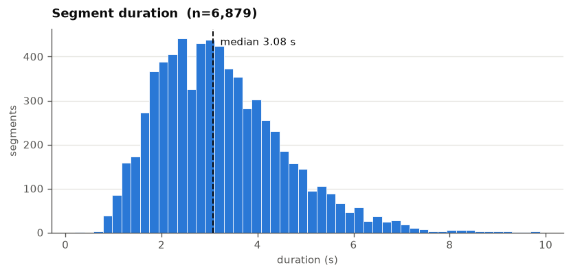
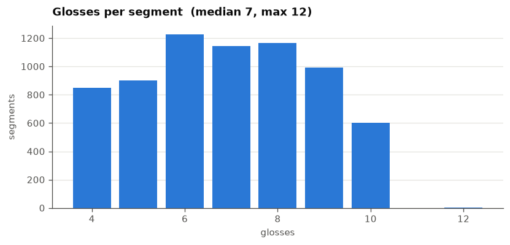
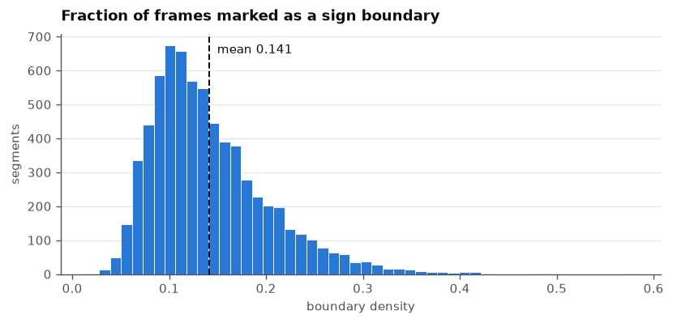
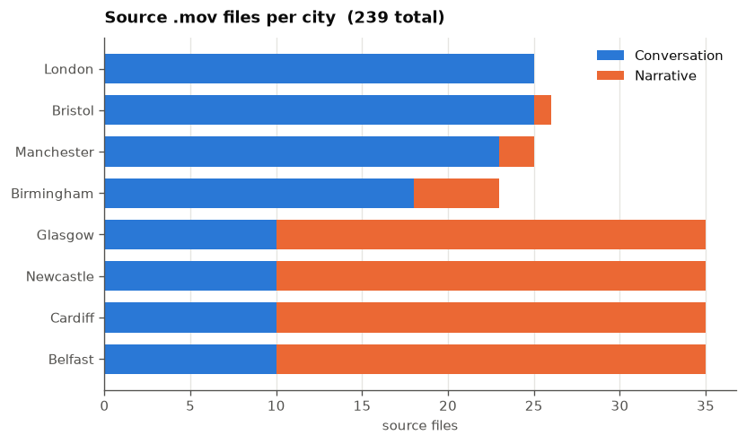

# BSL Corpus (BSLCP) — metadata exploration

**What this is.** A starting point for the BSL Corpus before we have any video.
We do not hold BSL Corpus media; what we do have is a preprocessed *metadata
and annotation* index, which is enough to plan the data request and to size the
work.

## Source and provenance

The file is `info.pkl`, the BSLCORPUS portion of the preprocessed release from
[RenzKa/sign-segmentation](https://github.com/RenzKa/sign-segmentation/tree/master/data)
(Renz et al., 2021), distributed via their Google Drive alongside `features.mat`
(1024-d I3D features, which we do not have).

It reached us indirectly: it is committed in our own fork on the **`bsl`
branch**, at `sign_language_segmentation/src/bslcp/info.pkl` (blob `deccc4e`,
added in commit `a717d35`), from earlier BSL Corpus finetuning experiments. It
is absent from `main`.

It is stored at `/shares/sign-language.ebling.cl.uzh/BSL_Corpus/info.pkl` —
**not in this repository** — since it is closed-access material and belongs
alongside the media we expect to receive. The cell below restores it from the
`bsl` branch if it is missing, so the notebook remains self-contained.

Provenance was confirmed field-by-field against the structure documented in
that repository — `words`, `words_to_id`, `videos.{name, org_name, start, end,
signer, split, glosses, gloss_ids}`, `alignments.{boundaries, gloss, gloss_id}`,
and the resolution block `T/H/W/duration_sec/fps` — with their documented split
encoding `0: train, 1: eval, 2: test`. Nothing is left over and nothing is
missing, so this is their file rather than an independent extraction.

**Consequence:** the `org_name` paths (`data/BSLCP/videos/...`) describe the
layout on *their* machine when the release was built. They identify which BSL
Corpus files underlie the data, but they do not resolve anywhere for us.

## Why this matters before requesting data from UCL

This index already gives frame-level sign boundaries, fixed splits comparable
with published numbers, and the exact list of source files involved. What it
does **not** give is poses or usable video — see the notes at the end.

## Configuration


```python
import subprocess
from pathlib import Path


def find_repo_root():
    """Walk up from the working directory until the package folder appears."""
    for base in [Path.cwd(), *Path.cwd().parents]:
        if (base / "sign_language_segmentation").is_dir():
            return base
    raise RuntimeError(f"cannot locate the segmentation repo root from {Path.cwd()}")


REPO_ROOT = find_repo_root()

# The metadata lives on the shared BSL Corpus directory, not in the repo: it is
# closed-access material and belongs with the media we expect to receive, not in
# version control. The directory is group-only (drwxrws---, group
# s3it_t_hpc_sign-language.ebling.cl.uzh) — keep it that way for anything added.
DATA_DIR = Path("/shares/sign-language.ebling.cl.uzh/BSL_Corpus")
INFO_PKL = DATA_DIR / "info.pkl"

# where it came from, if we need to restore it
SOURCE_REF = "bsl"
SOURCE_BLOB = "sign_language_segmentation/src/bslcp/info.pkl"

if not INFO_PKL.exists():
    print(f"{INFO_PKL.name} missing — restoring from the {SOURCE_REF} branch")
    INFO_PKL.write_bytes(
        subprocess.check_output(["git", "-C", str(REPO_ROOT), "show", f"{SOURCE_REF}:{SOURCE_BLOB}"])
    )

print(f"{'OK  ' if INFO_PKL.exists() else 'MISSING'} {INFO_PKL}  "
      f"({INFO_PKL.stat().st_size / 1e6:.1f} MB)")
```

    OK   /shares/sign-language.ebling.cl.uzh/BSL_Corpus/info.pkl  (7.4 MB)


## Provenance


```python
import datetime
import platform
import socket
import sys


def git(*args):
    try:
        return subprocess.check_output(["git", "-C", str(REPO_ROOT), *args], text=True).strip()
    except Exception:
        return "unavailable"


print(f"timestamp   {datetime.datetime.now().isoformat(timespec='seconds')}")
print(f"host        {socket.gethostname()}")
print(f"python      {platform.python_version()} ({sys.prefix})")
print(f"git branch  {git('rev-parse', '--abbrev-ref', 'HEAD')}")
print(f"git commit  {git('rev-parse', '--short', 'HEAD')}")
print(f"info.pkl    blob {git('rev-parse', f'{SOURCE_REF}:{SOURCE_BLOB}')[:12]}")
```

    timestamp   2026-08-10T17:53:50
    host        u24-cva0000-209
    python      3.11.15 (/home/zifjia/data/conda/envs/sas)
    git branch  segment-any-sign
    git commit  196896d
    info.pkl    blob deccc4e31a6a


## Structure

A dict with three top-level keys. `videos` is **column-oriented**: parallel
lists, one entry per annotated *segment*, not per source file.


```python
import pickle

info = pickle.load(open(INFO_PKL, "rb"))
videos = info["videos"]
alignments = videos["alignments"]
resolution = videos["videos"]  # nested dict: T, W, H, duration_sec, fps

n_segments = len(videos["name"])

print("top-level keys:", list(info))
print(f"\nsegments: {n_segments:,}\n")
print(f"{'field':16} {'kind':22} {'len':>7}")
for key, value in videos.items():
    kind = "list" if isinstance(value, list) else f"dict[{','.join(list(value))}]"
    print(f"  {key:14} {kind:22} {len(value):>7,}")
```

    top-level keys: ['videos', 'words', 'words_to_id']
    
    segments: 6,879
    
    field            kind                       len
      name           list                     6,879
      org_name       list                     6,879
      alignments     dict[boundaries,gloss,gloss_id]       3
      gloss_ids      list                     6,879
      glosses        list                     6,879
      signer         list                     6,879
      split          list                     6,879
      videos         dict[T,W,H,duration_sec,fps]       5
      start          list                     6,879
      end            list                     6,879


```python
# The key property for segmentation: alignments are FRAME-level, so their length
# equals the frame count T, while `glosses` is the per-segment label sequence.
frames = resolution["T"]
checks = {
    "len(alignments.boundaries) == T": sum(len(a) == t for a, t in zip(alignments["boundaries"], frames)),
    "len(alignments.gloss)      == T": sum(len(a) == t for a, t in zip(alignments["gloss"], frames)),
    "len(glosses) == len(gloss_ids)": sum(len(a) == len(b) for a, b in zip(videos["glosses"], videos["gloss_ids"])),
}
for label, count in checks.items():
    print(f"  {label}  {count:,}/{n_segments:,}  {'OK' if count == n_segments else 'MISMATCH'}")

print("\nexample segment 0")
print(f"  name      {videos['name'][0]}")
print(f"  org_name  {videos['org_name'][0]}")
print(f"  signer    {videos['signer'][0]}   split {videos['split'][0]}   "
      f"{videos['start'][0]}–{videos['end'][0]} s")
print(f"  glosses   {videos['glosses'][0][:6]} …")
print(f"  T={frames[0]}  {resolution['W'][0]}x{resolution['H'][0]}  {resolution['fps'][0]} fps")
```

      len(alignments.boundaries) == T  6,879/6,879  OK
      len(alignments.gloss)      == T  6,879/6,879  OK
      len(glosses) == len(gloss_ids)  6,879/6,879  OK
    
    example segment 0
      name      train/BF17n_000005-230_000008-570.mp4
      org_name  data/BSLCP/videos/Narrative/Belfast/17+18/BF17n.mov
      signer    BF17   split 0   5.23–8.57 s
      glosses   ['GOOD', 'PT:POSS1SG', 'G:WELL', 'PT:PRO1SG', 'HAVE', 'FAMILY'] …
      T=84  256x256  25.0 fps


## Basic statistics


```python
import collections
import statistics

import pandas as pd

SPLIT_NAMES = {0: "train", 1: "eval", 2: "test"}  # as documented by Renz et al.

segments = pd.DataFrame({
    "name": videos["name"],
    "org_name": videos["org_name"],
    "signer": videos["signer"],
    "split": [SPLIT_NAMES.get(s, str(s)) for s in videos["split"]],
    "start": videos["start"],
    "end": videos["end"],
    "n_glosses": [len(g) for g in videos["glosses"]],
    "frames": frames,
    "duration_sec": resolution["duration_sec"],
    "fps": resolution["fps"],
    "width": resolution["W"],
    "height": resolution["H"],
    "n_boundaries": [sum(b) for b in alignments["boundaries"]],
})
segments["boundary_density"] = segments["n_boundaries"] / segments["frames"]

# source file taxonomy: data/BSLCP/videos/<category>/<city>/<participants>/<id>.mov
parts = segments["org_name"].str.split("/")
segments["category"] = parts.str[3]
segments["city"] = parts.str[4]
segments["source_id"] = parts.str[-1].str.replace(".mov", "", regex=False)

print("=== BSL Corpus (Renz et al. preprocessed index) ===\n")
print(f"  annotated segments          {len(segments):,}")
print(f"  source .mov files           {segments['org_name'].nunique()}")
print(f"  signers                     {segments['signer'].nunique()}")
print(f"  total annotated time        {segments['duration_sec'].sum() / 3600:.1f} h")
print(f"  gloss vocabulary            {len(info['words'])}")
print(f"  gloss tokens                {segments['n_glosses'].sum():,}")
print(f"  frame rate                  {sorted(set(segments['fps']))}")
print(f"  frame size                  {sorted(set(zip(segments['width'], segments['height'])))}")
print(f"  boundary marks              {segments['n_boundaries'].sum():,}")
print(f"  mean boundary density       {segments['boundary_density'].mean():.3f}")
segments.head(3)
```

    === BSL Corpus (Renz et al. preprocessed index) ===
    
      annotated segments          6,879
      source .mov files           239
      signers                     198
      total annotated time        6.2 h
      gloss vocabulary            980
      gloss tokens                47,528
      frame rate                  [25.0]
      frame size                  [(256, 256)]
      boundary marks              71,286
      mean boundary density       0.141


<div>
<style scoped>
    .dataframe tbody tr th:only-of-type {
        vertical-align: middle;
    }

    .dataframe tbody tr th {
        vertical-align: top;
    }

    .dataframe thead th {
        text-align: right;
    }
</style>
<table border="1" class="dataframe">
  <thead>
    <tr style="text-align: right;">
      <th></th>
      <th>name</th>
      <th>org_name</th>
      <th>signer</th>
      <th>split</th>
      <th>start</th>
      <th>end</th>
      <th>n_glosses</th>
      <th>frames</th>
      <th>duration_sec</th>
      <th>fps</th>
      <th>width</th>
      <th>height</th>
      <th>n_boundaries</th>
      <th>boundary_density</th>
      <th>category</th>
      <th>city</th>
      <th>source_id</th>
    </tr>
  </thead>
  <tbody>
    <tr>
      <th>0</th>
      <td>train/BF17n_000005-230_000008-570.mp4</td>
      <td>data/BSLCP/videos/Narrative/Belfast/17+18/BF17...</td>
      <td>BF17</td>
      <td>train</td>
      <td>5.23</td>
      <td>8.57</td>
      <td>10</td>
      <td>84</td>
      <td>3.36</td>
      <td>25.0</td>
      <td>256</td>
      <td>256</td>
      <td>20</td>
      <td>0.238095</td>
      <td>Narrative</td>
      <td>Belfast</td>
      <td>BF17n</td>
    </tr>
    <tr>
      <th>1</th>
      <td>train/BF17n_000008-550_000012-050.mp4</td>
      <td>data/BSLCP/videos/Narrative/Belfast/17+18/BF17...</td>
      <td>BF17</td>
      <td>train</td>
      <td>8.55</td>
      <td>12.05</td>
      <td>10</td>
      <td>87</td>
      <td>3.48</td>
      <td>25.0</td>
      <td>256</td>
      <td>256</td>
      <td>16</td>
      <td>0.183908</td>
      <td>Narrative</td>
      <td>Belfast</td>
      <td>BF17n</td>
    </tr>
    <tr>
      <th>2</th>
      <td>train/BF17n_000012-070_000015-610.mp4</td>
      <td>data/BSLCP/videos/Narrative/Belfast/17+18/BF17...</td>
      <td>BF17</td>
      <td>train</td>
      <td>12.07</td>
      <td>15.61</td>
      <td>10</td>
      <td>88</td>
      <td>3.52</td>
      <td>25.0</td>
      <td>256</td>
      <td>256</td>
      <td>18</td>
      <td>0.204545</td>
      <td>Narrative</td>
      <td>Belfast</td>
      <td>BF17n</td>
    </tr>
  </tbody>
</table>
</div>


```python
by_split = segments.groupby("split").agg(
    segments=("name", "size"),
    source_files=("org_name", "nunique"),
    signers=("signer", "nunique"),
    hours=("duration_sec", lambda s: round(s.sum() / 3600, 2)),
    glosses=("n_glosses", "sum"),
).reindex(["train", "eval", "test"])
by_split
```


<div>
<style scoped>
    .dataframe tbody tr th:only-of-type {
        vertical-align: middle;
    }

    .dataframe tbody tr th {
        vertical-align: top;
    }

    .dataframe thead th {
        text-align: right;
    }
</style>
<table border="1" class="dataframe">
  <thead>
    <tr style="text-align: right;">
      <th></th>
      <th>segments</th>
      <th>source_files</th>
      <th>signers</th>
      <th>hours</th>
      <th>glosses</th>
    </tr>
    <tr>
      <th>split</th>
      <th></th>
      <th></th>
      <th></th>
      <th></th>
      <th></th>
    </tr>
  </thead>
  <tbody>
    <tr>
      <th>train</th>
      <td>5413</td>
      <td>189</td>
      <td>157</td>
      <td>4.86</td>
      <td>37368</td>
    </tr>
    <tr>
      <th>eval</th>
      <td>763</td>
      <td>25</td>
      <td>20</td>
      <td>0.69</td>
      <td>5380</td>
    </tr>
    <tr>
      <th>test</th>
      <td>703</td>
      <td>25</td>
      <td>21</td>
      <td>0.63</td>
      <td>4780</td>
    </tr>
  </tbody>
</table>
</div>


```python
# which BSL Corpus source files the index covers — this is the download manifest
manifest = (segments.groupby(["category", "city"])["source_id"].nunique()
            .unstack(fill_value=0))
manifest["total"] = manifest.sum(axis=1)
manifest.loc["total"] = manifest.sum()
manifest
```


<div>
<style scoped>
    .dataframe tbody tr th:only-of-type {
        vertical-align: middle;
    }

    .dataframe tbody tr th {
        vertical-align: top;
    }

    .dataframe thead th {
        text-align: right;
    }
</style>
<table border="1" class="dataframe">
  <thead>
    <tr style="text-align: right;">
      <th>city</th>
      <th>Belfast</th>
      <th>Birmingham</th>
      <th>Bristol</th>
      <th>Cardiff</th>
      <th>Glasgow</th>
      <th>London</th>
      <th>Manchester</th>
      <th>Newcastle</th>
      <th>total</th>
    </tr>
    <tr>
      <th>category</th>
      <th></th>
      <th></th>
      <th></th>
      <th></th>
      <th></th>
      <th></th>
      <th></th>
      <th></th>
      <th></th>
    </tr>
  </thead>
  <tbody>
    <tr>
      <th>Conversation</th>
      <td>10</td>
      <td>18</td>
      <td>25</td>
      <td>10</td>
      <td>10</td>
      <td>25</td>
      <td>23</td>
      <td>10</td>
      <td>131</td>
    </tr>
    <tr>
      <th>Narrative</th>
      <td>25</td>
      <td>5</td>
      <td>1</td>
      <td>25</td>
      <td>25</td>
      <td>0</td>
      <td>2</td>
      <td>25</td>
      <td>108</td>
    </tr>
    <tr>
      <th>total</th>
      <td>35</td>
      <td>23</td>
      <td>26</td>
      <td>35</td>
      <td>35</td>
      <td>25</td>
      <td>25</td>
      <td>35</td>
      <td>239</td>
    </tr>
  </tbody>
</table>
</div>


```python
gloss_counts = collections.Counter(g for lst in videos["glosses"] for g in lst)
print(f"gloss types in use: {len(gloss_counts)} (vocabulary lists {len(info['words'])})")
print(f"\ntop 15 glosses:")
for gloss, count in gloss_counts.most_common(15):
    print(f"  {gloss:16} {count:6,}")

pointing = sum(c for g, c in gloss_counts.items() if g.startswith("PT:"))
print(f"\npointing glosses (PT:*)  {pointing:,} tokens "
      f"({100 * pointing / sum(gloss_counts.values()):.1f}% of all tokens)")
```

    gloss types in use: 978 (vocabulary lists 980)
    
    top 15 glosses:
      PT:PRO1SG         4,449
      G:WELL            2,429
      PT:PRO3SG         1,903
      PT:               1,182
      PT:PRO2SG           932
      PT:LOC              895
      GOOD                796
      PT:DET              751
      SAME                633
      LOOK                593
      WHAT                504
      PT:POSS1SG          459
      G:ERM               365
      DEAF                339
      ONE                 336
    
    pointing glosses (PT:*)  12,013 tokens (25.3% of all tokens)


## Annotation density — what we actually hold

The annotation here is richer than a gloss list: `alignments.gloss` gives the
**active gloss at every frame**, so exact gloss spans are recoverable at 40 ms
resolution without touching the original ELAN files.

The cell below quantifies the property that most affects how this data can be
used: whether there is a background ("no sign") class.


```python
import itertools

vocab = set(info["words"])
frame_labels = collections.Counter()
for arr in alignments["gloss"]:
    frame_labels.update(arr)

total_frames = sum(frame_labels.values())
background = {label: n for label, n in frame_labels.items() if label not in vocab}

print(f"  frames with a gloss label   {total_frames:,}")
print(f"  labels outside the vocab    {background or 'none'}")
for label, n in background.items():
    print(f"    {label:12} {n:,} frames ({100 * n / total_frames:.2f}%)")

boundary_per_gloss = [sum(b) / max(1, len(g)) for b, g in zip(alignments["boundaries"], videos["glosses"])]
print(f"\n  boundary marks per gloss    mean {statistics.mean(boundary_per_gloss):.2f}, "
      f"median {statistics.median(boundary_per_gloss):.2f}")
print("  (a transition window of variable width, not a single frame)")

runs = [(label, len(list(group))) for label, group in itertools.groupby(alignments["gloss"][0])]
print(f"\n  example — segment 0 covers {frames[0]} frames in {len(runs)} label runs:")
print(f"    {runs}")
```

      frames with a gloss label   556,344
      labels outside the vocab    {'SILENCE': 3898}
        SILENCE      3,898 frames (0.70%)
    
      boundary marks per gloss    mean 1.51, median 1.38
      (a transition window of variable width, not a single frame)
    
      example — segment 0 covers 84 frames in 11 label runs:
        [('GOOD', 14), ('PT:POSS1SG', 8), ('G:WELL', 4), ('PT:PRO1SG', 4), ('HAVE', 4), ('FAMILY', 8), ('PT:PRO1SG', 11), ('BIG', 12), ('SILENCE', 1), ('FAMILY', 15), ('PT:PRO1SG', 3)]


### What this implies

**Signs tile the timeline back to back.** Only ~0.7% of frames carry the
`SILENCE` background label; every other frame is assigned to a gloss. These
segments were cut *to* continuous signing.

Two consequences worth carrying forward:

1. **The label distribution is unlike DGS**, where non-signing frames are
   common — our 2023-model run on SignSuisse predicted signs covering only ~52%
   of each clip. A DGS-trained model that legitimately predicts `O` here will
   look wrong through no fault of its own. Any comparison needs to account for
   this, or restrict scoring to signing regions.
2. **This data cannot test false positives during non-signing**, which is one
   of the edge cases the project cares about. That requires the unannotated
   stretches between segments — i.e. the source video.

**Coverage is a subset.** 6,879 segments / 6.2 h, each located in its source by
`start`/`end`. Everything between segments is unannotated here, and the corpus
as a whole is much larger.

**A second copy of the timings exists.** `data_merged.csv` on the `bsl` branch
holds explicit `start_gloss`/`end_gloss` in seconds for 188 videos. Cross-
checking the two would validate both before either is trusted.

## Distributions


```python
import matplotlib.pyplot as plt

# categorical slots 1-3 of the validated reference palette
BLUE, ORANGE, AQUA = "#2a78d6", "#eb6834", "#1baf7a"
INK, MUTED = "#0b0b0b", "#52514e"

plt.rcParams.update({
    "figure.dpi": 120,
    "figure.facecolor": "white",
    "axes.facecolor": "white",
    "axes.edgecolor": MUTED,
    "axes.labelcolor": MUTED,
    "axes.titlesize": 11,
    "axes.titleweight": "semibold",
    "axes.spines.top": False,
    "axes.spines.right": False,
    "text.color": INK,
    "xtick.color": MUTED,
    "ytick.color": MUTED,
    "font.size": 9,
    "grid.color": "#e6e5e1",
    "grid.linewidth": 0.8,
})


def style(ax, title, xlabel, ylabel="count", axis="y"):
    """Recessive grid on the value axis only; titles carry the identity."""
    ax.set_title(title, loc="left", color=INK, pad=10)
    ax.set_xlabel(xlabel)
    ax.set_ylabel(ylabel)
    ax.grid(axis=axis, zorder=0)
    ax.set_axisbelow(True)
    return ax
```


```python
fig, ax = plt.subplots(figsize=(7, 3.4))
ax.hist(segments["duration_sec"], bins=50, color=BLUE, edgecolor="white", linewidth=0.5, zorder=2)
median = segments["duration_sec"].median()
ax.axvline(median, color=INK, linewidth=1.2, linestyle="--", zorder=3)
ax.annotate(f"median {median:.2f} s", xy=(median, ax.get_ylim()[1] * 0.92),
            xytext=(6, 0), textcoords="offset points", color=INK, fontsize=9)
style(ax, f"Segment duration  (n={len(segments):,})", "duration (s)", "segments")
plt.tight_layout()
plt.show()
```

    findfont: Failed to find font weight semibold, now using 700.


    

    


```python
counts_gloss = segments["n_glosses"].value_counts().sort_index()

fig, ax = plt.subplots(figsize=(7, 3.4))
ax.bar(counts_gloss.index, counts_gloss.values, color=BLUE, width=0.82, zorder=2)
style(ax, f"Glosses per segment  (median {segments['n_glosses'].median():.0f}, "
          f"max {segments['n_glosses'].max()})", "glosses", "segments")
plt.tight_layout()
plt.show()
```


    

    


```python
fig, ax = plt.subplots(figsize=(7, 3.4))
ax.hist(segments["boundary_density"], bins=50, color=BLUE, edgecolor="white",
        linewidth=0.5, zorder=2)
mean_density = segments["boundary_density"].mean()
ax.axvline(mean_density, color=INK, linewidth=1.2, linestyle="--", zorder=3)
ax.annotate(f"mean {mean_density:.3f}", xy=(mean_density, ax.get_ylim()[1] * 0.92),
            xytext=(6, 0), textcoords="offset points", color=INK, fontsize=9)
style(ax, "Fraction of frames marked as a sign boundary", "boundary density", "segments")
plt.tight_layout()
plt.show()
```


    

    


```python
# source files per city, split by recording category
per_city = (segments.groupby(["city", "category"])["source_id"].nunique()
            .unstack(fill_value=0).sort_values(by="Conversation"))

fig, ax = plt.subplots(figsize=(7, 4.2))
bottom = None
for category, colour in (("Conversation", BLUE), ("Narrative", ORANGE)):
    if category not in per_city:
        continue
    ax.barh(per_city.index, per_city[category], left=bottom, color=colour,
            height=0.72, label=category, zorder=2)
    bottom = per_city[category] if bottom is None else bottom + per_city[category]
ax.legend(frameon=False, labelcolor=INK)
style(ax, f"Source .mov files per city  ({segments['org_name'].nunique()} total)",
      "source files", "", axis="x")
plt.tight_layout()
plt.show()
```


    

    


## Notes and caveats

- **This is metadata only — we hold no BSL Corpus video.** The index describes
  clips we do not have. It is a planning artefact, not a dataset.
- **The clips it describes are 256×256 crops at 25 fps**, already preprocessed
  by Renz et al. Even if we obtained them, that resolution and framing is a poor
  basis for MediaPipe pose extraction. Full-frame source video is what pose
  estimation would want, which is the substantive reason to approach UCL.
- **No poses and no features here.** The companion `features.mat` (1024-d I3D)
  is not in our copy, and I3D features are not usable by a pose-based
  segmentation model in any case.
- **`org_name` paths do not resolve for us.** They record the layout on the
  authors' machine; they identify the underlying BSL Corpus files and nothing
  more.
- **Count discrepancy to resolve.** This index references 239 source files,
  while `data.csv` / `data_merged.csv` on the same `bsl` branch cover 188
  videos. The CSVs are a filtered subset — plausibly dropping files that failed
  the `is_video_wellformed` check in that branch's `bslcp/data.py`. Worth
  settling before quoting corpus sizes or sizing a data request.
- **Splits are comparable with published numbers.** The `0/1/2` encoding is
  Renz et al.'s own, so scores computed on these splits line up with the
  "Katrin et al., 2021" baseline recorded in that branch's `results.csv`.
- **Licensing.** Redistribution terms for this derived release are the authors'
  to set, and are separate from BSL Corpus's own conditions. Both need checking
  before anything is published or re-shared.

## TODO

- [ ] **Get the real videos.** Request the source `.mov` files from UCL as
      academic collaborators. We have the exact manifest (239 files, with
      category / city / participant folder / ID), so the request can be
      specific. Full-frame source is the point — the clips this index describes
      are 256×256 crops, unsuitable for MediaPipe.
- [ ] **Resolve 239 vs 188.** This index references 239 source files; the
      `bsl` branch CSVs cover 188. Probably the `is_video_wellformed` filter in
      `bslcp/data.py`. Settle it before quoting sizes or sizing the request.
- [ ] **Cross-check the two annotation copies** — frame-level `alignments.gloss`
      here against `start_gloss`/`end_gloss` in `data_merged.csv`.
- [ ] **Decide how to score against back-to-back annotation**, given there is
      effectively no background class (see above). Either restrict scoring to
      signing regions or obtain unannotated stretches.
- [ ] **Extract poses** once video arrives, and confirm which pose format the
      benchmark standardises on.
- [ ] **Check licensing** — the Primo record marks rights `closed` alongside a
      CC BY-NC-SA 2.0 UK string, and Renz et al.'s redistribution terms for the
      derived index are separate again. Both need clarifying before publishing
      anything derived from this.
- [ ] **Keep the share group-only.** `/shares/sign-language.ebling.cl.uzh/BSL_Corpus`
      is `drwxrws---`; anything added should stay that way.

### Running and exporting

In VS Code, open this file and run the `# %%` cells directly.

To regenerate `explore.md` — run from `segment-any-sign/`:

```bash
jupytext --to ipynb --execute datasets/bsl_corpus/explore.py -o - \
  | jupyter nbconvert --stdin --to markdown --output explore --output-dir datasets/bsl_corpus
```
