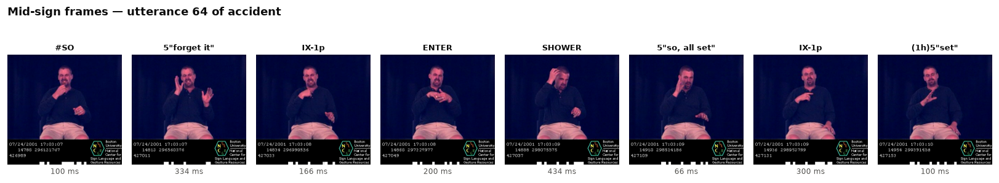
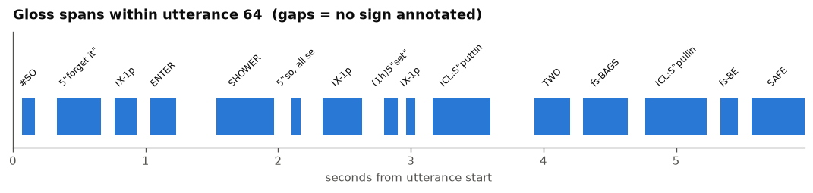
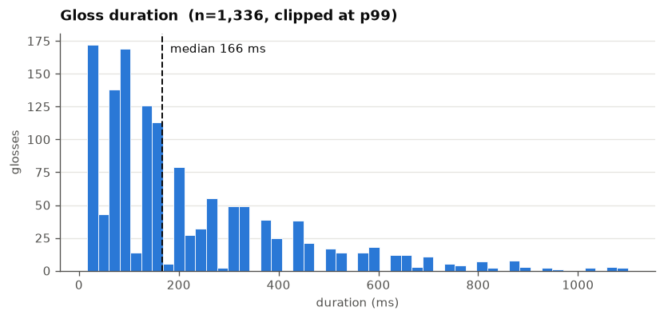
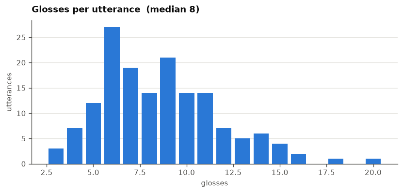
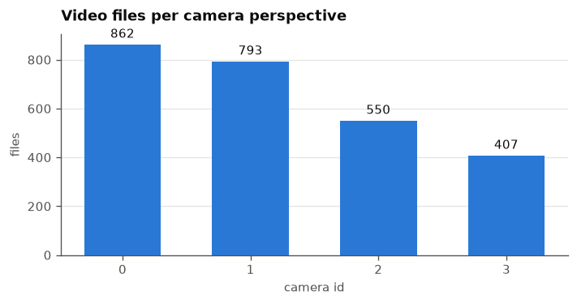

# NCSLGR Corpus (ASL) — data exploration

The **National Center for Sign Language and Gesture Resources (NCSLGR)
Corpus**: continuous ASL, annotated with SignStream® 2, released 2007 by the
American Sign Language Linguistic Research Project (ASLLRP) at Boston
University.

**Why this corpus.** It is the only ASL resource we found with **per-sign gloss
boundaries** — the label format sign segmentation needs. How2Sign's glosses are
sentence-timed and unreleased; MEDIAPI-SKEL has no glosses at all. See
`../how2sign/` and `../mediapi_skel/`.

## ASLLRP ships two corpora — this is only the first

| | NCSLGR (here) | ASLLRP SignStream 3 |
|---|---|---|
| annotation tool | SignStream 2 | SignStream 3 |
| utterances | 1,887 | 2,127 |
| sign tokens | 11,854 | 17,522 |
| annotation richness | one label per sign; **no handedness, no handshapes** | both hands, sign type, start/end handshapes |
| account needed | for XML only | yes |

The SignStream 3 corpus is a separate dataset and should get its own
`datasets/asllrp_signstream3/`.

## Licence — read before publishing anything

There is **no named licence**. From <https://www.bu.edu/asllrp/dai-terms.html>:

> "The data available from these pages can be used for **research and education
> purposes**, but **cannot be redistributed without permission**."
> "**Commercial use, without explicit permission, is not allowed**."
> "Those making use of these data must, in resulting publications or
> presentations, include **appropriate citations**."

Internal use on our share is fine. Any derived public release — a benchmark
package, poses, a HuggingFace dataset — needs explicit permission from
Prof. Carol Neidle. Worth settling early rather than at publication time. The
share directory is group-only for the same reason.

## Configuration


```python
from pathlib import Path

DATA_DIR = Path("/shares/sign-language.ebling.cl.uzh/NCSLGR")
VIDEO_DIR = DATA_DIR / "videos"
INDEX_CSV = DATA_DIR / "video_index-20120129" / "video_index-20120129" / "files_by_video_name.csv"

# Only two real corpus XMLs are available without a DAI account — they ship as
# test fixtures inside the SignStream parser package. The rest need an account;
# point XML_DIR at the full set once we have it.
XML_DIR = DATA_DIR / "signstream-xmlparser" / "signstream-xmlparser" / "test" / "resources"

# SignStream track ids (see the CODING-SCHEME section of any XML file)
GLOSS_FID = "10000"        # main gloss — one annotation per sign
TRANSLATION_FID = "20001"  # English translation — one per utterance

# SignStream "movie times" are NOT milliseconds. Measured against the actual
# video duration below, the timescale is 2000 units per second — the last
# annotation in accident.ss3.xml ends at 561,533 units against a 280.8 s video,
# i.e. 1999.8 units/s. Dividing by 1000 instead would double every duration and
# make the corpus look twice as slow as it is.
TIMESCALE = 2000.0         # units per second
FPS = 30.0                 # video frame rate

for path in (DATA_DIR, VIDEO_DIR, INDEX_CSV, XML_DIR):
    print(f"{'OK  ' if path.exists() else 'MISSING'} {path}")
```

    OK   /shares/sign-language.ebling.cl.uzh/NCSLGR
    OK   /shares/sign-language.ebling.cl.uzh/NCSLGR/videos
    OK   /shares/sign-language.ebling.cl.uzh/NCSLGR/video_index-20120129/video_index-20120129/files_by_video_name.csv
    OK   /shares/sign-language.ebling.cl.uzh/NCSLGR/signstream-xmlparser/signstream-xmlparser/test/resources


## Provenance


```python
import datetime
import platform
import socket
import subprocess
import sys


def find_repo_root():
    for base in [Path.cwd(), *Path.cwd().parents]:
        if (base / "sign_language_segmentation").is_dir():
            return base
    raise RuntimeError(f"cannot locate the segmentation repo root from {Path.cwd()}")


REPO_ROOT = find_repo_root()


def git(*args):
    try:
        return subprocess.check_output(["git", "-C", str(REPO_ROOT), *args], text=True).strip()
    except Exception:
        return "unavailable"


print(f"timestamp   {datetime.datetime.now().isoformat(timespec='seconds')}")
print(f"host        {socket.gethostname()}")
print(f"python      {platform.python_version()} ({sys.prefix})")
print(f"git branch  {git('rev-parse', '--abbrev-ref', 'HEAD')}")
print(f"git commit  {git('rev-parse', '--short', 'HEAD')}")
print(f"data        {DATA_DIR}")
```

    timestamp   2026-08-11T14:30:01
    host        u24-cva0000-209
    python      3.11.15 (/home/zifjia/data/conda/envs/sas)
    git branch  segment-any-sign
    git commit  b42b121
    data        /shares/sign-language.ebling.cl.uzh/NCSLGR


## Video inventory

Downloaded by `download.py` from the URLs in the corpus video index. Each
recording exists in up to four synchronised camera perspectives.


```python
import csv
import io

import pandas as pd

raw = INDEX_CSV.read_bytes().decode("utf-8", errors="replace")
raw = raw.replace("\r\n", "\n").replace("\r", "\n")  # old Mac CR line endings
index_rows = list(csv.DictReader(io.StringIO(raw)))

videos = pd.DataFrame({
    "name": [r["Video file name in XML file"].strip() for r in index_rows],
    "camera": [(r.get("Perspective/Camera id") or "?").strip() for r in index_rows],
    "xml_refs": [(r.get("Occurs in XML file:Utterance id; ...") or "").strip() for r in index_rows],
})
videos["xml_file"] = videos["xml_refs"].str.split(":").str[0]

on_disk = {p.name: p.stat().st_size for p in VIDEO_DIR.glob("*.mov")}
videos["size_mb"] = videos["name"].map(lambda n: on_disk.get(n, 0) / 1e6)
videos["present"] = videos["size_mb"] > 0

print(f"  index entries        {len(videos):,}")
print(f"  files on disk        {len(on_disk):,}")
print(f"  total size           {sum(on_disk.values()) / 1e9:.2f} GB")
print(f"  cameras              {videos['camera'].value_counts().to_dict()}")
print(f"  distinct xml files   {videos['xml_file'].nunique()}")
print(f"\n  size (MB): mean {videos['size_mb'].mean():.2f}  median {videos['size_mb'].median():.2f}  "
      f"max {videos['size_mb'].max():.1f}")
videos.head(3)
```

      index entries        2,612
      files on disk        2,636
      total size           4.72 GB
      cameras              {'0': 862, '1': 793, '2': 550, '3': 407}
      distinct xml files   38
    
      size (MB): mean 1.20  median 0.60  max 194.0


<div>
<style scoped>
    .dataframe tbody tr th:only-of-type {
        vertical-align: middle;
    }

    .dataframe tbody tr th {
        vertical-align: top;
    }

    .dataframe thead th {
        text-align: right;
    }
</style>
<table border="1" class="dataframe">
  <thead>
    <tr style="text-align: right;">
      <th></th>
      <th>name</th>
      <th>camera</th>
      <th>xml_refs</th>
      <th>xml_file</th>
      <th>size_mb</th>
      <th>present</th>
    </tr>
  </thead>
  <tbody>
    <tr>
      <th>0</th>
      <td>539_219_small_0.mov</td>
      <td>0</td>
      <td>ncslgr10l.xml:0</td>
      <td>ncslgr10l.xml</td>
      <td>0.605385</td>
      <td>True</td>
    </tr>
    <tr>
      <th>1</th>
      <td>539_219_small_1.mov</td>
      <td>1</td>
      <td>ncslgr10l.xml:0</td>
      <td>ncslgr10l.xml</td>
      <td>0.650821</td>
      <td>True</td>
    </tr>
    <tr>
      <th>2</th>
      <td>539_219_small_2.mov</td>
      <td>2</td>
      <td>ncslgr10l.xml:0</td>
      <td>ncslgr10l.xml</td>
      <td>0.838625</td>
      <td>True</td>
    </tr>
  </tbody>
</table>
</div>


## Annotations

### The XML format

Each file is a `SIGNSTREAM-DATABASE` with `PARTICIPANTS`, a `CODING-SCHEME`
defining numbered fields, `MEDIA-FILES`, and `UTTERANCES`. Every utterance has
a `SEGMENT` containing `TRACK` elements; a track's `FID` refers to a coding
scheme field, and each `<A>` element is one annotation with `S`/`E` times.

**Track `10000` is the main gloss track — one annotation per sign.** That is
what makes this corpus usable for sign-level segmentation.

Times are "movie times" in **milliseconds**. Utterance `S`/`E` are absolute
within the video; annotation `S`/`E` are relative to the utterance. Frames
convert as `time_seconds * 30.0`.


```python
import xml.etree.ElementTree as ET


def parse_signstream(path: Path) -> tuple[list[dict], list[dict]]:
    """Return (utterance rows, gloss rows) from one SignStream XML file."""
    root = ET.parse(path).getroot()
    fields = {f.get("ID"): f.get("NAME") for f in root.find("CODING-SCHEME")}

    utterances, glosses = [], []
    for utterance in root.find("UTTERANCES"):
        u_id = utterance.get("ID")
        u_start, u_end = int(utterance.get("S", 0)), int(utterance.get("E", 0))
        segment = utterance.find("SEGMENT")
        if segment is None:
            continue

        tracks = {t.get("FID"): t for t in segment.findall("TRACK")}
        gloss_track = tracks.get(GLOSS_FID)
        gloss_annotations = gloss_track.findall("A") if gloss_track is not None else []

        translation_track = tracks.get(TRANSLATION_FID)
        translation = ""
        if translation_track is not None:
            values = [(a.text or "").strip() for a in translation_track.findall("A")]
            translation = " ".join(v for v in values if v)

        for annotation in gloss_annotations:
            start, end = int(annotation.get("S")), int(annotation.get("E"))
            glosses.append({
                "file": path.stem, "utterance": u_id,
                "gloss": (annotation.text or "").strip(),
                # raw units, relative to the utterance
                "start_units": start, "end_units": end,
                # absolute position in the video, in seconds
                "start_sec": (u_start + start) / TIMESCALE,
                "end_sec": (u_start + end) / TIMESCALE,
                "duration_ms": (end - start) / TIMESCALE * 1000,
            })

        utterances.append({
            "file": path.stem, "utterance": u_id,
            "start_units": u_start, "end_units": u_end,
            "start_sec": u_start / TIMESCALE, "end_sec": u_end / TIMESCALE,
            "duration_ms": (u_end - u_start) / TIMESCALE * 1000,
            "n_glosses": len(gloss_annotations),
            "n_tracks": len(tracks),
            "excerpt": utterance.get("EXCERPT", ""),
            "translation": translation,
        })
    return utterances, glosses


xml_files = sorted(p for p in XML_DIR.glob("*.ss3.xml") if not p.stem.startswith("bad_"))
print(f"parsing {len(xml_files)} XML files: {[p.stem for p in xml_files]}")

utterance_rows, gloss_rows = [], []
for path in xml_files:
    u, g = parse_signstream(path)
    utterance_rows += u
    gloss_rows += g

utterances = pd.DataFrame(utterance_rows)
glosses = pd.DataFrame(gloss_rows)
print(f"  utterances {len(utterances):,}   gloss tokens {len(glosses):,}")
```

    parsing 3 XML files: ['accident.ss3', 'ali.ss3', 'ncslgr10a.ss3']
      utterances 157   gloss tokens 1,350


```python
print("=== NCSLGR annotation statistics (available files only) ===\n")
print(f"  files                    {utterances['file'].nunique()}")
print(f"  utterances               {len(utterances):,}")
print(f"  gloss tokens             {len(glosses):,}")
print(f"  gloss types              {glosses['gloss'].nunique():,}")
print(f"  glosses per utterance    mean {utterances['n_glosses'].mean():.1f}  "
      f"median {utterances['n_glosses'].median():.0f}  max {utterances['n_glosses'].max()}")

fingerspelled = glosses["gloss"].str.startswith("fs-").sum()
indexing = glosses["gloss"].str.startswith("IX").sum()
classifiers = glosses["gloss"].str.contains("CL", na=False).sum()
total = len(glosses)
print(f"\n  fingerspelled (fs-*)     {fingerspelled:,} ({100 * fingerspelled / total:.1f}%)")
print(f"  indexing (IX*)           {indexing:,} ({100 * indexing / total:.1f}%)")
print(f"  classifiers (*CL*)       {classifiers:,} ({100 * classifiers / total:.1f}%)")

pd.DataFrame({
    "gloss duration (ms)": glosses["duration_ms"],
    "utterance duration (ms)": utterances["duration_ms"],
    "glosses per utterance": utterances["n_glosses"],
}).describe(percentiles=[0.1, 0.5, 0.9]).round(1)
```

    === NCSLGR annotation statistics (available files only) ===
    
      files                    3
      utterances               157
      gloss tokens             1,350
      gloss types              476
      glosses per utterance    mean 8.6  median 8  max 20
    
      fingerspelled (fs-*)     96 (7.1%)
      indexing (IX*)           171 (12.7%)
      classifiers (*CL*)       63 (4.7%)


<div>
<style scoped>
    .dataframe tbody tr th:only-of-type {
        vertical-align: middle;
    }

    .dataframe tbody tr th {
        vertical-align: top;
    }

    .dataframe thead th {
        text-align: right;
    }
</style>
<table border="1" class="dataframe">
  <thead>
    <tr style="text-align: right;">
      <th></th>
      <th>gloss duration (ms)</th>
      <th>utterance duration (ms)</th>
      <th>glosses per utterance</th>
    </tr>
  </thead>
  <tbody>
    <tr>
      <th>count</th>
      <td>1350.0</td>
      <td>157.0</td>
      <td>157.0</td>
    </tr>
    <tr>
      <th>mean</th>
      <td>231.7</td>
      <td>3146.0</td>
      <td>8.6</td>
    </tr>
    <tr>
      <th>std</th>
      <td>242.8</td>
      <td>1642.1</td>
      <td>3.2</td>
    </tr>
    <tr>
      <th>min</th>
      <td>16.5</td>
      <td>633.0</td>
      <td>3.0</td>
    </tr>
    <tr>
      <th>10%</th>
      <td>33.5</td>
      <td>1050.0</td>
      <td>5.0</td>
    </tr>
    <tr>
      <th>50%</th>
      <td>166.5</td>
      <td>3366.5</td>
      <td>8.0</td>
    </tr>
    <tr>
      <th>90%</th>
      <td>533.0</td>
      <td>5280.2</td>
      <td>13.0</td>
    </tr>
    <tr>
      <th>max</th>
      <td>2700.0</td>
      <td>7309.0</td>
      <td>20.0</td>
    </tr>
  </tbody>
</table>
</div>


```python
print("most frequent glosses:")
for gloss, count in glosses["gloss"].value_counts().head(15).items():
    print(f"  {gloss:<24} {count:>4}")
```

    most frequent glosses:
      IX-1p                     108
                                 55
      REALLY                     44
      fs-JOHN                    31
      BOOK                       26
      part:indef                 25
      READ                       19
      IX-3p:i                    18
      IX-3p:k                    18
      FUTURE                     17
      CAR                        17
      SAME                       15
      POSS-1p                    15
      FINISH                     15
      NOT                        12


## Plot setup


```python
import matplotlib.pyplot as plt
import numpy as np

BLUE, ORANGE, AQUA = "#2a78d6", "#eb6834", "#1baf7a"
INK, MUTED = "#0b0b0b", "#52514e"

plt.rcParams.update({
    "figure.dpi": 120, "figure.facecolor": "white", "axes.facecolor": "white",
    "axes.edgecolor": MUTED, "axes.labelcolor": MUTED, "axes.titlesize": 11,
    "axes.titleweight": "semibold", "axes.spines.top": False, "axes.spines.right": False,
    "text.color": INK, "xtick.color": MUTED, "ytick.color": MUTED, "font.size": 9,
    "grid.color": "#e6e5e1", "grid.linewidth": 0.8,
})


def style(ax, title, xlabel, ylabel="count", axis="y"):
    """Recessive grid on the value axis only; titles carry the identity."""
    ax.set_title(title, loc="left", color=INK, pad=10)
    ax.set_xlabel(xlabel)
    ax.set_ylabel(ylabel)
    ax.grid(axis=axis, zorder=0)
    ax.set_axisbelow(True)
    return ax
```

## What the annotation actually looks like

One utterance, drawn as a timeline of its gloss spans with a video frame taken
from the middle of each sign. This is the quickest way to see whether the
boundaries land where they should.

Two practical wrinkles are handled here:

1. **Long recordings are split into parts.** The XML refers to
   `accident_1065_small_0.mov`, but on disk that is
   `Accident_1065_small_0_0.mov` (198.4 s) + `Accident_1065_small_0_1.mov`
   (82.4 s). An absolute timestamp has to be mapped to the right part.
2. **The timescale is 2000 units/s**, not 1000 — see the config cell.


```python
import imageio.v2 as imageio


def video_parts(stem: str) -> list[tuple[Path, float]]:
    """Ordered [(path, duration_sec)] for a media file that may be split.

    The XML names `accident_1065_small_0.mov`; disk may hold that name directly,
    or capitalised `_0`/`_1` parts.
    """
    direct = VIDEO_DIR / stem
    if direct.exists():
        candidates = [direct]
    else:
        base = stem.replace(".mov", "")
        candidates = sorted(VIDEO_DIR.glob(f"{base}_*.mov")) or \
            sorted(VIDEO_DIR.glob(f"{base.capitalize()}_*.mov"))
    parts = []
    for path in candidates:
        try:
            parts.append((path, imageio.get_reader(path).get_meta_data()["duration"]))
        except Exception:
            continue
    return parts


def frame_at(parts: list[tuple[Path, float]], t_sec: float):
    """Grab the frame at absolute time t_sec, crossing part boundaries."""
    offset = t_sec
    for path, duration in parts:
        if offset < duration:
            reader = imageio.get_reader(path)
            fps = reader.get_meta_data().get("fps", FPS)
            return reader.get_data(int(offset * fps))
        offset -= duration
    return None


media_stem = "accident_1065_small_0.mov"
parts = video_parts(media_stem)
print(f"{media_stem} -> {len(parts)} part(s)")
for path, duration in parts:
    print(f"   {path.name}  {duration:.1f}s")
print(f"   total {sum(d for _, d in parts):.1f}s")
```

    accident_1065_small_0.mov -> 2 part(s)
       Accident_1065_small_0_0.mov  198.4s
       Accident_1065_small_0_1.mov  82.4s
       total 280.8s


```python
# pick an utterance with a good number of signs from the file we have video for
EXAMPLE_FILE = next(f for f in utterances["file"].unique() if f.startswith("accident"))
candidates = utterances[utterances["file"] == EXAMPLE_FILE].sort_values("n_glosses", ascending=False)
example = candidates.iloc[min(3, len(candidates) - 1)]
signs = glosses[(glosses["file"] == EXAMPLE_FILE)
                & (glosses["utterance"] == example["utterance"])]

print(f"utterance {example['utterance']}  "
      f"{example['start_sec']:.2f}s -> {example['end_sec']:.2f}s  "
      f"({example['n_glosses']} glosses)")
print(f"translation: {example['translation'][:110]}")
signs[["gloss", "start_sec", "end_sec", "duration_ms"]].head(12).round(2)
```

    utterance 64  246.40s -> 252.37s  (15 glosses)
    translation: So anyway, I went in the shower--I had put two bags on my hand to be safe.


<div>
<style scoped>
    .dataframe tbody tr th:only-of-type {
        vertical-align: middle;
    }

    .dataframe tbody tr th {
        vertical-align: top;
    }

    .dataframe thead th {
        text-align: right;
    }
</style>
<table border="1" class="dataframe">
  <thead>
    <tr style="text-align: right;">
      <th></th>
      <th>gloss</th>
      <th>start_sec</th>
      <th>end_sec</th>
      <th>duration_ms</th>
    </tr>
  </thead>
  <tbody>
    <tr>
      <th>167</th>
      <td>#SO</td>
      <td>246.47</td>
      <td>246.57</td>
      <td>100.0</td>
    </tr>
    <tr>
      <th>168</th>
      <td>5"forget it"</td>
      <td>246.73</td>
      <td>247.07</td>
      <td>333.5</td>
    </tr>
    <tr>
      <th>169</th>
      <td>IX-1p</td>
      <td>247.17</td>
      <td>247.33</td>
      <td>166.5</td>
    </tr>
    <tr>
      <th>170</th>
      <td>ENTER</td>
      <td>247.43</td>
      <td>247.63</td>
      <td>200.0</td>
    </tr>
    <tr>
      <th>171</th>
      <td>SHOWER</td>
      <td>247.93</td>
      <td>248.37</td>
      <td>433.5</td>
    </tr>
    <tr>
      <th>172</th>
      <td>5"so, all set"</td>
      <td>248.50</td>
      <td>248.57</td>
      <td>66.5</td>
    </tr>
    <tr>
      <th>173</th>
      <td>IX-1p</td>
      <td>248.73</td>
      <td>249.03</td>
      <td>300.0</td>
    </tr>
    <tr>
      <th>174</th>
      <td>(1h)5"set"</td>
      <td>249.20</td>
      <td>249.30</td>
      <td>100.0</td>
    </tr>
    <tr>
      <th>175</th>
      <td>IX-1p</td>
      <td>249.37</td>
      <td>249.43</td>
      <td>66.5</td>
    </tr>
    <tr>
      <th>176</th>
      <td>ICL:S"putting bag on hand"</td>
      <td>249.57</td>
      <td>250.00</td>
      <td>433.5</td>
    </tr>
    <tr>
      <th>177</th>
      <td>TWO</td>
      <td>250.33</td>
      <td>250.60</td>
      <td>267.0</td>
    </tr>
    <tr>
      <th>178</th>
      <td>fs-BAGS</td>
      <td>250.70</td>
      <td>251.03</td>
      <td>333.0</td>
    </tr>
  </tbody>
</table>
</div>


```python
show = signs.head(8)
frames = [frame_at(parts, (row["start_sec"] + row["end_sec"]) / 2) for _, row in show.iterrows()]
frames = [f for f in frames if f is not None]

if frames:
    fig, axes = plt.subplots(1, len(frames), figsize=(1.7 * len(frames), 2.6))
    for ax, (_, row), frame in zip(np.atleast_1d(axes), show.iterrows(), frames):
        ax.imshow(frame)
        ax.set_title(row["gloss"][:16], fontsize=8, color=INK, pad=4)
        ax.set_xlabel(f"{row['duration_ms']:.0f} ms", fontsize=7, color=MUTED)
        ax.set_xticks([])
        ax.set_yticks([])
        for spine in ax.spines.values():
            spine.set_visible(False)
    fig.suptitle(f"Mid-sign frames — utterance {example['utterance']} of accident",
                 x=0.01, ha="left", fontsize=11, fontweight="semibold", color=INK)
    plt.tight_layout()
    plt.show()
else:
    print("no frames decoded — check the video parts above")
```

    findfont: Failed to find font weight semibold, now using 700.


    findfont: Failed to find font weight semibold, now using 700.


    

    


```python
# the same utterance as a timeline: where each sign starts and ends
fig, ax = plt.subplots(figsize=(9, 2.2))
origin = example["start_sec"]
for i, (_, row) in enumerate(signs.iterrows()):
    start, width = row["start_sec"] - origin, row["end_sec"] - row["start_sec"]
    ax.barh(0, width, left=start, height=0.5, color=BLUE, zorder=2)
    ax.text(start + width / 2, 0.36, row["gloss"][:12], ha="center", va="bottom",
            fontsize=7, rotation=45, color=INK)
ax.set_ylim(-0.4, 1.1)
ax.set_yticks([])
ax.set_xlim(0, example["end_sec"] - origin)
style(ax, f"Gloss spans within utterance {example['utterance']}  "
          f"(gaps = no sign annotated)", "seconds from utterance start", "")
plt.tight_layout()
plt.show()
```


    

    


## Distributions


```python
clip = glosses["duration_ms"].quantile(0.99)
values = glosses.loc[glosses["duration_ms"] <= clip, "duration_ms"]

fig, ax = plt.subplots(figsize=(7, 3.4))
ax.hist(values, bins=50, color=BLUE, edgecolor="white", linewidth=0.5, zorder=2)
median = glosses["duration_ms"].median()
ax.axvline(median, color=INK, linewidth=1.2, linestyle="--", zorder=3)
ax.annotate(f"median {median:,.0f} ms", xy=(median, ax.get_ylim()[1] * 0.92),
            xytext=(6, 0), textcoords="offset points", color=INK, fontsize=9)
style(ax, f"Gloss duration  (n={len(values):,}, clipped at p99)", "duration (ms)", "glosses")
plt.tight_layout()
plt.show()
```


    

    


```python
counts = utterances["n_glosses"].value_counts().sort_index()

fig, ax = plt.subplots(figsize=(7, 3.4))
ax.bar(counts.index, counts.values, color=BLUE, width=0.82, zorder=2)
style(ax, f"Glosses per utterance  (median {utterances['n_glosses'].median():.0f})",
      "glosses", "utterances")
plt.tight_layout()
plt.show()
```


    

    


```python
per_camera = videos.groupby("camera")["size_mb"].agg(["count", "sum"])

fig, ax = plt.subplots(figsize=(6, 3.2))
bars = ax.bar(per_camera.index, per_camera["count"], color=BLUE, width=0.6, zorder=2)
ax.bar_label(bars, fmt="%d", padding=3, color=INK, fontsize=9)
style(ax, "Video files per camera perspective", "camera id", "files")
plt.tight_layout()
plt.show()
```


    

    


## Notes and caveats

- **Only 2 of ~13 XML files are available here.** `accident` and `ali` ship as
  test fixtures inside the SignStream parser package. Everything above is
  computed on those two, so the statistics are a *sample*, not the corpus.
  The full XML needs a free DAI account — see TODO.
- **The `Archive-ssdb` download is binary**, not XML. Those 39 collection files
  are SignStream 2 database files, readable only by SignStream itself (a Mac
  Classic application). They are not a substitute for the XML export.
- **The timescale is 2000 units/second, not milliseconds.** This is the single
  most important thing to get right, and nothing states it explicitly. It was
  established by measurement: the last annotation in `accident.ss3.xml` ends at
  561,533 units against a 280.8 s video, i.e. 1999.8 units/s. Treating the
  values as milliseconds doubles every duration — and would have made gloss
  durations look like ~400 ms against the Public DGS Corpus's 180 ms, inviting
  a bogus conclusion about annotation conventions. Correctly converted, the
  median gloss is **~200 ms**, closely comparable to DGS.
- **Video is SVQ1 (Sorenson Video 1) in `yuv410p`, 324x312, 30 fps.** That
  chroma format carries colour at a quarter resolution in each axis, so colour
  is badly degraded — frames show a strong cast, and mean channel values are
  nowhere near neutral. Luminance is intact. Whether MediaPipe copes with this
  is the main open technical risk; test before relying on the corpus.
- **Sign categories are marked in the gloss string itself**: `fs-` prefixes
  fingerspelling, `IX` indexing, `CL` classifiers. That makes the proposal's
  fingerspelling and indexing questions a filtering exercise rather than new
  annotation work.
- **NCSLGR annotations are shallower than SignStream 3**: one label per sign,
  with no handedness and no handshapes. Unlike DGS, there is no merging of two
  hands — so no overlapping gloss spans, which actually simplifies BIO tagging.
- **Videos are old and small** (2000-2001 recordings, ~0.5 MB each, 4 camera
  views). Pose-estimation quality on this footage is unverified and is the main
  technical risk in using this corpus.

## TODO

- [ ] **Register a free DAI account** (login link at
      <https://dai.cs.rutgers.edu/dai/s/daioriginal>) and download the full XML
      annotations. The same account unlocks the SignStream 3 corpus.
- [ ] Re-run this notebook with `XML_DIR` pointing at the full set.
- [ ] Confirm the 2000 units/s timescale holds for **every** file, not just the
      three checked here — compare each file's last annotation against its
      video duration.
- [ ] Run MediaPipe on a sample and check pose quality before committing to the
      corpus.
- [ ] Compare gloss-duration conventions against DGS to decide whether scores
      are comparable.
- [ ] Clarify redistribution permission with Carol Neidle if anything derived is
      to be published.

### Running and exporting

```bash
jupytext --to ipynb --execute datasets/ncslgr/explore.py -o - \
  | jupyter nbconvert --stdin --to markdown --output explore --output-dir datasets/ncslgr
```
