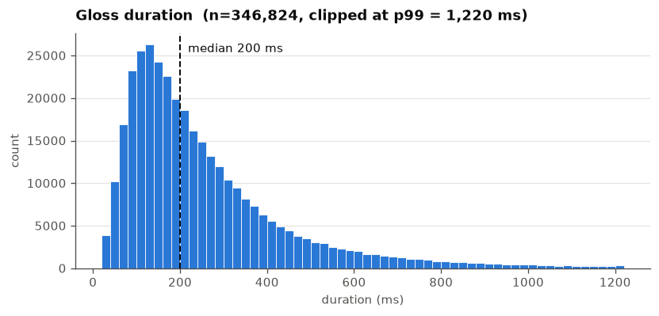
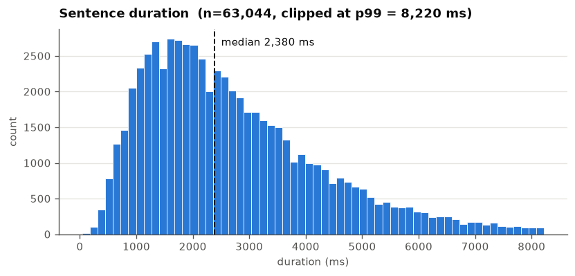
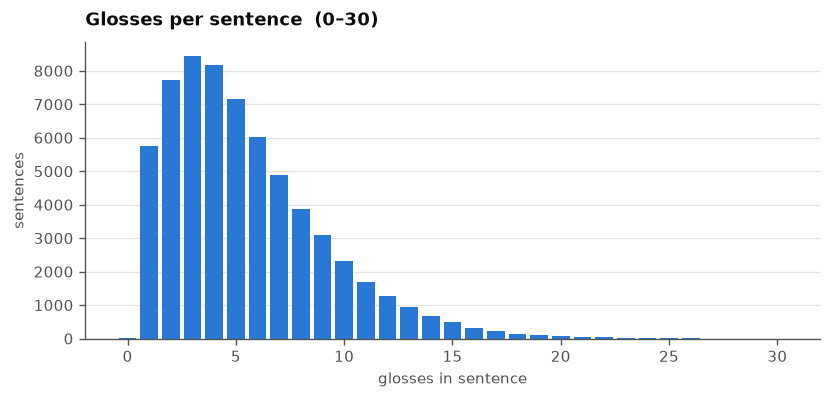
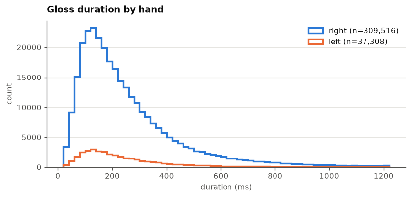
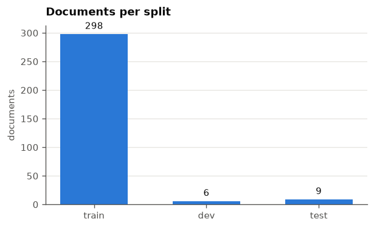

# Public DGS Corpus — data exploration

Reads the Public DGS Corpus ELAN annotations from our copy on the server and
reports basic statistics.

This file is a notebook in *percent* format: the `# %%` markers are rendered as
runnable cells by VS Code (and by Jupyter via jupytext), but the file itself is
plain Python, so it diffs and reviews cleanly in git.

**Why we read the backup and not the TFDS build.** The 2023 TFDS build under
`/shares/iict-sp2.../tensorflow_datasets` stores annotations as *file paths*
pointing into `/shares/volk.cl.uzh/zifjia/tensorflow_datasets_2/downloads/`,
which we no longer have read permission for (group `s3it_t_hpc_volk.cl.uzh`).
The same files survive in a backup with identical basenames, so we read them
directly.

This also means **no TensorFlow, torch or pose-format is needed** — the pose
tensors play no part in annotation statistics. Only `pympi-ling`, `pandas` and
`matplotlib`.

ELAN parsing reuses the repo's own `get_elan_sentences`, so these numbers
reflect exactly what the model sees during training.

## Configuration


```python
from pathlib import Path

# eaf/cmdi backup — the files the TFDS records reference
DOWNLOADS = Path("/home/zifjia/sp2/zifjia/backups/tensorflow_datasets_2/downloads")

# repo root: .../segmentation
REPO_ROOT = Path.cwd().parents[2] if Path.cwd().name == "public_dgs_corpus" else Path(__file__).resolve().parents[3]
SPLITS_PATH = REPO_ROOT / "sign_language_segmentation" / "datasets" / "dgs" / "splits.json"
ELAN_UTILS_PATH = REPO_ROOT / "sign_language_segmentation" / "datasets" / "dgs" / "utils.py"

# documents the training loader drops (datasets/dgs/dataset.py)
EXCLUDED_IDS = {"1289910", "1245887", "1289868", "1246064", "1584617"}

# set to an int for a quick smoke run, None for the full corpus
LIMIT = None

for path in (DOWNLOADS, SPLITS_PATH, ELAN_UTILS_PATH):
    print(f"{'OK  ' if path.exists() else 'MISSING'} {path}")
```

    OK   /home/zifjia/sp2/zifjia/backups/tensorflow_datasets_2/downloads
    OK   /home/zifjia/segmentation/sign_language_segmentation/datasets/dgs/splits.json
    OK   /home/zifjia/segmentation/sign_language_segmentation/datasets/dgs/utils.py


## Provenance

Recorded in the output so any exported report says exactly what produced it.


```python
import datetime
import platform
import socket
import subprocess
import sys


def git(*args):
    try:
        return subprocess.check_output(["git", "-C", str(REPO_ROOT), *args], text=True).strip()
    except Exception:
        return "unavailable"


print(f"timestamp   {datetime.datetime.now().isoformat(timespec='seconds')}")
print(f"host        {socket.gethostname()}")
print(f"python      {platform.python_version()} ({sys.prefix})")
print(f"repo        {REPO_ROOT}")
print(f"git branch  {git('rev-parse', '--abbrev-ref', 'HEAD')}")
print(f"git commit  {git('rev-parse', '--short', 'HEAD')}")
print(f"git dirty   {'yes' if git('status', '--porcelain') else 'no'}")
print(f"data        {DOWNLOADS}")
```

    timestamp   2026-08-06T15:24:27
    host        u24-cva0000-302
    python      3.11.15 (/home/zifjia/data/conda/envs/sas)
    repo        /home/zifjia/segmentation
    git branch  segment-any-sign
    git commit  a6db76d
    git dirty   yes
    data        /home/zifjia/sp2/zifjia/backups/tensorflow_datasets_2/downloads


## Loading

Documents are identified via the TFDS `.INFO` sidecars, which record the
original filename (`<doc_id>.eaf`) alongside each hash-named download.


```python
import importlib.util
import json


def load_elan_utils(path):
    """Import the repo's dgs/utils.py by file path.

    Importing it as a module would pull in the datasets package __init__, which
    imports torch and pose_format. We only want the ELAN parser.
    """
    spec = importlib.util.spec_from_file_location("dgs_elan_utils", path)
    module = importlib.util.module_from_spec(spec)
    spec.loader.exec_module(module)
    return module


def index_documents(downloads):
    """Map doc_id -> {'eaf': path, 'cmdi': path} using the TFDS .INFO sidecars."""
    documents = {}
    for info_path in Path(downloads).glob("*.INFO"):
        payload = info_path.with_suffix("")  # strip .INFO
        if not payload.exists():
            continue
        kind = payload.suffix.lstrip(".")
        if kind not in ("eaf", "cmdi"):
            continue
        try:
            info = json.loads(info_path.read_text())
        except (OSError, json.JSONDecodeError):
            continue
        original = info.get("original_fname")
        if original:
            documents.setdefault(Path(original).stem, {})[kind] = payload
    return documents


def base_id(doc_id):
    """Leading numeric part; some documents carry -<start>-<end> suffixes."""
    return doc_id.split("-")[0]


def assign_split(doc_id, dev, test):
    for name, ids in (("dev", dev), ("test", test)):
        if doc_id in ids or base_id(doc_id) in {base_id(i) for i in ids}:
            return name
    return "train"


def is_joke(cmdi_path):
    if cmdi_path is None or not cmdi_path.exists():
        return False
    try:
        return "<cmdp:Task>Joke</cmdp:Task>" in cmdi_path.read_text(errors="ignore")
    except OSError:
        return False


def overlapping_flags(spans):
    """Per-span flag: does it overlap any other span?

    Both hands are merged into one gloss list, so simultaneous two-handed
    signing shows up here.
    """
    flags = [False] * len(spans)
    order = sorted(range(len(spans)), key=lambda i: spans[i])
    for a in range(len(order) - 1):
        i = order[a]
        for b in range(a + 1, len(order)):
            j = order[b]
            if spans[j][0] >= spans[i][1]:
                break
            flags[i] = flags[j] = True
    return flags


elan = load_elan_utils(ELAN_UTILS_PATH)
splits = json.loads(SPLITS_PATH.read_text())
dev_ids, test_ids = set(splits.get("dev", [])), set(splits.get("test", []))

documents = index_documents(DOWNLOADS)
print(f"indexed {len(documents)} documents")
print(f"splits.json: {len(dev_ids)} dev, {len(test_ids)} test")
```

    indexed 406 documents
    splits.json: 10 dev, 10 test


```python
# apply the same filtering the training loader uses
skipped = {"excluded_id": [], "joke": [], "no_eaf": []}
kept = []

for doc_id in sorted(documents):
    if "eaf" not in documents[doc_id]:
        skipped["no_eaf"].append(doc_id)
    elif base_id(doc_id) in EXCLUDED_IDS:
        skipped["excluded_id"].append(doc_id)
    elif is_joke(documents[doc_id].get("cmdi")):
        skipped["joke"].append(doc_id)
    else:
        kept.append(doc_id)

if LIMIT:
    kept = kept[:LIMIT]

print(f"keeping {len(kept)} documents")
for reason, ids in skipped.items():
    print(f"  skipped {reason:<12} {len(ids)}")
```

    keeping 313 documents
      skipped excluded_id  5
      skipped joke         88
      skipped no_eaf       0


```python
# parse every kept document into tidy per-sentence and per-gloss records
doc_rows, sentence_rows, gloss_rows, failed = [], [], [], []

for index, doc_id in enumerate(kept, start=1):
    if index % 50 == 0 or index == len(kept):
        print(f"  ...{index}/{len(kept)}", flush=True)
    try:
        sentences = list(elan.get_elan_sentences(str(documents[doc_id]["eaf"])))
    except Exception as error:  # a few files are known to be malformed
        failed.append({"doc_id": doc_id, "error": type(error).__name__})
        continue

    split = assign_split(doc_id, dev_ids, test_ids)
    doc_glosses = 0

    for sentence in sentences:
        participant = str(sentence.get("participant", "?")).upper()
        glosses = sentence.get("glosses") or []
        start, end = sentence.get("start"), sentence.get("end")

        sentence_rows.append({
            "doc_id": doc_id, "split": split, "participant": participant,
            "start_ms": start, "end_ms": end,
            "duration_ms": (end - start) if (start is not None and end is not None) else None,
            "n_glosses": len(glosses),
            "n_mouthings": len(sentence.get("mouthings") or []),
            "has_english": bool(sentence.get("english")),
        })

        spans = [(g["start"], g["end"]) for g in glosses
                 if g.get("start") is not None and g.get("end") is not None]
        flags = overlapping_flags(spans) if len(spans) == len(glosses) else [False] * len(glosses)

        for gloss, overlaps in zip(glosses, flags):
            g_start, g_end = gloss.get("start"), gloss.get("end")
            gloss_rows.append({
                "doc_id": doc_id, "split": split, "participant": participant,
                "hand": gloss.get("hand", "?"), "gloss": gloss.get("gloss"),
                "start_ms": g_start, "end_ms": g_end,
                "duration_ms": (g_end - g_start) if (g_start is not None and g_end is not None) else None,
                "overlaps_other": overlaps,
            })
        doc_glosses += len(glosses)

    doc_rows.append({"doc_id": doc_id, "split": split,
                     "n_sentences": len(sentences), "n_glosses": doc_glosses})

print(f"\nparsed {len(doc_rows)} documents, {len(failed)} failures")
if failed:
    print(failed[:5])
```

      ...50/313


      ...100/313


      ...150/313


      ...200/313


      ...250/313


      ...300/313


      ...313/313


    
    parsed 313 documents, 0 failures


```python
import pandas as pd

docs = pd.DataFrame(doc_rows)
sents = pd.DataFrame(sentence_rows)
gl = pd.DataFrame(gloss_rows)

print(f"documents {len(docs):>9,}")
print(f"sentences {len(sents):>9,}")
print(f"glosses   {len(gl):>9,}")
gl.head()
```

    documents       313
    sentences    63,672
    glosses     350,168


<div>
<style scoped>
    .dataframe tbody tr th:only-of-type {
        vertical-align: middle;
    }

    .dataframe tbody tr th {
        vertical-align: top;
    }

    .dataframe thead th {
        text-align: right;
    }
</style>
<table border="1" class="dataframe">
  <thead>
    <tr style="text-align: right;">
      <th></th>
      <th>doc_id</th>
      <th>split</th>
      <th>participant</th>
      <th>hand</th>
      <th>gloss</th>
      <th>start_ms</th>
      <th>end_ms</th>
      <th>duration_ms</th>
      <th>overlaps_other</th>
    </tr>
  </thead>
  <tbody>
    <tr>
      <th>0</th>
      <td>1176340</td>
      <td>train</td>
      <td>A</td>
      <td>r</td>
      <td>WISSEN2B^</td>
      <td>175100</td>
      <td>175240</td>
      <td>140</td>
      <td>False</td>
    </tr>
    <tr>
      <th>1</th>
      <td>1176340</td>
      <td>train</td>
      <td>A</td>
      <td>r</td>
      <td>$GEST-AUFMERKSAMKEIT1^</td>
      <td>175400</td>
      <td>175720</td>
      <td>320</td>
      <td>False</td>
    </tr>
    <tr>
      <th>2</th>
      <td>1176340</td>
      <td>train</td>
      <td>A</td>
      <td>r</td>
      <td>BEISPIEL1*</td>
      <td>175820</td>
      <td>175980</td>
      <td>160</td>
      <td>False</td>
    </tr>
    <tr>
      <th>3</th>
      <td>1176340</td>
      <td>train</td>
      <td>A</td>
      <td>r</td>
      <td>FUSSBALL2</td>
      <td>176200</td>
      <td>176440</td>
      <td>240</td>
      <td>False</td>
    </tr>
    <tr>
      <th>4</th>
      <td>1176340</td>
      <td>train</td>
      <td>A</td>
      <td>r</td>
      <td>VERGANGENHEIT1^*</td>
      <td>176860</td>
      <td>177060</td>
      <td>200</td>
      <td>False</td>
    </tr>
  </tbody>
</table>
</div>


## Summary


```python
print("=== Public DGS Corpus — basic statistics ===\n")
print(f"  documents read              {len(docs):,}")
for split in ("train", "dev", "test"):
    print(f"    {split:<24} {int((docs['split'] == split).sum()):,}")
print(f"  sentences                   {len(sents):,}")
print(f"  glosses                     {len(gl):,}")
print(f"  sentences by participant    {sents['participant'].value_counts().to_dict()}")
print(f"  glosses by hand             {gl['hand'].value_counts().to_dict()}")
print(f"  sentences with no gloss     {int((sents['n_glosses'] == 0).sum()):,}")
print(f"  documents with no gloss     {int((docs['n_glosses'] == 0).sum()):,}")
overlap_pct = 100 * gl["overlaps_other"].mean() if len(gl) else 0
print(f"  glosses overlapping another {int(gl['overlaps_other'].sum()):,} ({overlap_pct:.1f}%)")

summary = pd.DataFrame({
    "gloss duration (ms)": gl["duration_ms"].describe(percentiles=[0.1, 0.5, 0.9]),
    "sentence duration (ms)": sents["duration_ms"].describe(percentiles=[0.1, 0.5, 0.9]),
    "glosses per sentence": sents["n_glosses"].describe(percentiles=[0.1, 0.5, 0.9]),
})
summary.round(1)
```

    === Public DGS Corpus — basic statistics ===
    
      documents read              313
        train                    298
        dev                      6
        test                     9
      sentences                   63,672
      glosses                     350,168
      sentences by participant    {'B': 32380, 'A': 31292}
      glosses by hand             {'r': 312497, 'l': 37671}
      sentences with no gloss     10
      documents with no gloss     0
      glosses overlapping another 5,974 (1.7%)


<div>
<style scoped>
    .dataframe tbody tr th:only-of-type {
        vertical-align: middle;
    }

    .dataframe tbody tr th {
        vertical-align: top;
    }

    .dataframe thead th {
        text-align: right;
    }
</style>
<table border="1" class="dataframe">
  <thead>
    <tr style="text-align: right;">
      <th></th>
      <th>gloss duration (ms)</th>
      <th>sentence duration (ms)</th>
      <th>glosses per sentence</th>
    </tr>
  </thead>
  <tbody>
    <tr>
      <th>count</th>
      <td>350168.0</td>
      <td>63672.0</td>
      <td>63672.0</td>
    </tr>
    <tr>
      <th>mean</th>
      <td>260.4</td>
      <td>2768.1</td>
      <td>5.5</td>
    </tr>
    <tr>
      <th>std</th>
      <td>244.2</td>
      <td>1671.1</td>
      <td>3.6</td>
    </tr>
    <tr>
      <th>min</th>
      <td>20.0</td>
      <td>40.0</td>
      <td>0.0</td>
    </tr>
    <tr>
      <th>10%</th>
      <td>80.0</td>
      <td>1000.0</td>
      <td>2.0</td>
    </tr>
    <tr>
      <th>50%</th>
      <td>200.0</td>
      <td>2380.0</td>
      <td>5.0</td>
    </tr>
    <tr>
      <th>90%</th>
      <td>520.0</td>
      <td>5040.0</td>
      <td>10.0</td>
    </tr>
    <tr>
      <th>max</th>
      <td>7040.0</td>
      <td>11800.0</td>
      <td>32.0</td>
    </tr>
  </tbody>
</table>
</div>


```python
# per-split totals
by_split = pd.DataFrame({
    "documents": docs.groupby("split").size(),
    "sentences": sents.groupby("split").size(),
    "glosses": gl.groupby("split").size(),
}).reindex(["train", "dev", "test"]).fillna(0).astype(int)
by_split["glosses/sentence"] = (by_split["glosses"] / by_split["sentences"]).round(2)
by_split
```


<div>
<style scoped>
    .dataframe tbody tr th:only-of-type {
        vertical-align: middle;
    }

    .dataframe tbody tr th {
        vertical-align: top;
    }

    .dataframe thead th {
        text-align: right;
    }
</style>
<table border="1" class="dataframe">
  <thead>
    <tr style="text-align: right;">
      <th></th>
      <th>documents</th>
      <th>sentences</th>
      <th>glosses</th>
      <th>glosses/sentence</th>
    </tr>
    <tr>
      <th>split</th>
      <th></th>
      <th></th>
      <th></th>
      <th></th>
    </tr>
  </thead>
  <tbody>
    <tr>
      <th>train</th>
      <td>298</td>
      <td>61130</td>
      <td>336137</td>
      <td>5.5</td>
    </tr>
    <tr>
      <th>dev</th>
      <td>6</td>
      <td>967</td>
      <td>5992</td>
      <td>6.2</td>
    </tr>
    <tr>
      <th>test</th>
      <td>9</td>
      <td>1575</td>
      <td>8039</td>
      <td>5.1</td>
    </tr>
  </tbody>
</table>
</div>


## Distributions


```python
import matplotlib.pyplot as plt

# categorical slots 1-3 of the validated reference palette
BLUE, ORANGE, AQUA = "#2a78d6", "#eb6834", "#1baf7a"
INK, MUTED = "#0b0b0b", "#52514e"

plt.rcParams.update({
    "figure.dpi": 120,
    "figure.facecolor": "white",
    "axes.facecolor": "white",
    "axes.edgecolor": MUTED,
    "axes.labelcolor": MUTED,
    "axes.titlesize": 11,
    "axes.titleweight": "semibold",
    "axes.spines.top": False,
    "axes.spines.right": False,
    "text.color": INK,
    "xtick.color": MUTED,
    "ytick.color": MUTED,
    "font.size": 9,
    "grid.color": "#e6e5e1",
    "grid.linewidth": 0.8,
})


def style(ax, title, xlabel, ylabel="count"):
    """Recessive grid on the value axis only; titles carry the identity."""
    ax.set_title(title, loc="left", color=INK, pad=10)
    ax.set_xlabel(xlabel)
    ax.set_ylabel(ylabel)
    ax.grid(axis="y", zorder=0)
    ax.set_axisbelow(True)
    return ax
```


```python
# gloss durations — clipped at the 99th percentile so the long tail
# does not flatten the body of the distribution
clip = gl["duration_ms"].quantile(0.99)
values = gl.loc[gl["duration_ms"] <= clip, "duration_ms"]

fig, ax = plt.subplots(figsize=(7, 3.4))
ax.hist(values, bins=60, color=BLUE, edgecolor="white", linewidth=0.5, zorder=2)
median = gl["duration_ms"].median()
ax.axvline(median, color=INK, linewidth=1.2, linestyle="--", zorder=3)
ax.annotate(f"median {median:,.0f} ms", xy=(median, ax.get_ylim()[1] * 0.92),
            xytext=(6, 0), textcoords="offset points", color=INK, fontsize=9)
style(ax, f"Gloss duration  (n={len(values):,}, clipped at p99 = {clip:,.0f} ms)", "duration (ms)")
plt.tight_layout()
plt.show()
```

    findfont: Failed to find font weight semibold, now using 700.


    

    


```python
# sentence durations
clip_s = sents["duration_ms"].quantile(0.99)
values_s = sents.loc[sents["duration_ms"] <= clip_s, "duration_ms"]

fig, ax = plt.subplots(figsize=(7, 3.4))
ax.hist(values_s, bins=60, color=BLUE, edgecolor="white", linewidth=0.5, zorder=2)
median_s = sents["duration_ms"].median()
ax.axvline(median_s, color=INK, linewidth=1.2, linestyle="--", zorder=3)
ax.annotate(f"median {median_s:,.0f} ms", xy=(median_s, ax.get_ylim()[1] * 0.92),
            xytext=(6, 0), textcoords="offset points", color=INK, fontsize=9)
style(ax, f"Sentence duration  (n={len(values_s):,}, clipped at p99 = {clip_s:,.0f} ms)", "duration (ms)")
plt.tight_layout()
plt.show()
```


    

    


```python
# glosses per sentence
counts = sents["n_glosses"].value_counts().sort_index()
counts = counts[counts.index <= 30]

fig, ax = plt.subplots(figsize=(7, 3.4))
ax.bar(counts.index, counts.values, color=BLUE, width=0.82, zorder=2)
style(ax, "Glosses per sentence  (0–30)", "glosses in sentence", "sentences")
plt.tight_layout()
plt.show()
```


    

    


```python
# gloss duration by hand — the loader merges both hands into one list,
# so this is a check on whether the two behave alike
fig, ax = plt.subplots(figsize=(7, 3.4))
for hand, colour, label in (("r", BLUE, "right"), ("l", ORANGE, "left")):
    subset = gl.loc[(gl["hand"] == hand) & (gl["duration_ms"] <= clip), "duration_ms"]
    ax.hist(subset, bins=60, histtype="step", linewidth=2, color=colour,
            label=f"{label} (n={len(subset):,})", zorder=2)
ax.legend(frameon=False, labelcolor=INK)
style(ax, "Gloss duration by hand", "duration (ms)")
plt.tight_layout()
plt.show()
```


    

    


```python
# corpus size per split
fig, ax = plt.subplots(figsize=(5.2, 3.2))
bars = ax.bar(by_split.index, by_split["documents"], color=BLUE, width=0.6, zorder=2)
ax.bar_label(bars, fmt="%d", padding=3, color=INK, fontsize=9)
style(ax, "Documents per split", "", "documents")
plt.tight_layout()
plt.show()
```


    

    


## Notes and caveats

Things to keep in mind when quoting these numbers:

- **Both hands are merged.** `get_elan_sentences` concatenates the
  `Lexem_Gebärde_r_*` and `Lexem_Gebärde_l_*` tiers into one flat gloss list, so
  simultaneous two-handed signing appears as overlapping spans. The overlap
  percentage above quantifies how often. Sign-level BIO tagging cannot represent
  two signs at once, so these overlaps are a genuine source of label noise.
- **Glosses must be fully contained in a sentence** to be attached to it; any
  gloss straddling a sentence boundary is silently dropped, so the gloss total is
  a lower bound.
- **Sentences come from the German translation tier**, not from a prosodic or
  syntactic annotation — a "sentence" boundary here is a translation unit.
- **Filtering matches the training loader**: five hardcoded document IDs plus
  everything tagged `<cmdp:Task>Joke</cmdp:Task>`. Any published "DGS" number
  must state this.
- **Document counts**: the `dgs.json` index ships 406 documents while the 2023
  TFDS build has 404 (384 train + 10 dev + 10 test). Worth reconciling before
  these counts go into a paper.

### Running and exporting

In VS Code, open this file and run the `# %%` cells directly, or use
`Run Current File in Interactive Window`.

To regenerate `explore.md` — run from `segment-any-sign/`. This executes the
file top-to-bottom in a fresh kernel, so the report always matches the
committed source, and no intermediate `.ipynb` is written:

```bash
jupytext --to ipynb --execute datasets/public_dgs_corpus/explore.py -o - \
  | jupyter nbconvert --stdin --to markdown --output explore --output-dir datasets/public_dgs_corpus
```

Markdown rather than HTML because GitHub renders it inline. The plots land in
`explore_files/`; `explore.py`, `explore.md` and that folder are all tracked.
