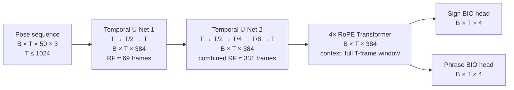

# Experiments

Training and finetuning. [`../benchmark/`](../benchmark/) stays inference-only on
published checkpoints; anything with a training loop lives here.

## Basic model



The two temporal U-Nets learn progressively wider local motion patterns while
restoring the original frame rate after each block. Together they give each
frame an approximately 331-frame receptive field (about 6.6 seconds at 50 fps).
The Transformer then relates every frame to the complete training window. Both
heads retain the original temporal resolution and predict one BIO distribution
per input frame. Full validation and test videos are processed as independent
1024-frame Transformer chunks.

## Rules

The [benchmarking rules](../benchmark/README.md#rules) apply unchanged: one
evaluation protocol for every run, inherited from 2023. An experiment may change
the *model*; it may not change how it is scored. Final numbers come from
`benchmark/score.py` on the same DGS test clips, so an experiment row and a
benchmark row are directly comparable.

Each run also reports **dev** numbers — test is for the final table only.

## Layout

```
experiments/
  README.md          this file — the plan and the ablation table
  <NN>_<slug>/       one directory per experiment
    README.md        what changed, why, and the result
    train.sh         the exact command (SLURM), so the run is repeatable
```

## What differs, apart from the architecture

Read off both codebases (`v2023 src/` and `main sign_language_segmentation/`).
This is the candidate list to ablate — the architecture swap is deliberately not
in it.

### Data and features

| | 2023 | 2026 |
|---|---|---|
| source | TFDS `holistic-25` build | raw `.pose` + `.eaf`, read directly |
| fps | fixed 25 | native 50 |
| pose cleanup | own `pose_utils.pose_hide_legs` — zeroes 8 leg points **and their confidences** | `preprocess_pose`: `pose_hide_legs` → `reduce_holistic` → `normalize_mean_std` (pose-anonymization) |
| face | dropped | dropped |
| extra features | E4 only: optical flow + 3D hand normalisation | velocity (fps-normalised), always on |
| input | 3 components, xyz | 50 joints × 6 dims |

### Labels

| | 2023 | 2026 |
|---|---|---|
| BIO ids | `O=0, B=1, I=2` | `UNK=0, O=1, B=2, I=3` |
| span → frames | `build_bio` walk for training/frame metrics; `floor`/`floor` inclusive for segment metrics | `create_bio` (floor/ceil), or `create_bio_from_times` (searchsorted on timestamps) when `fps_aug` |
| phrase = | first gloss → last gloss | the `Deutsche_Übersetzung` tier's own bounds |
| clip set | keeps signer-videos with no glosses | drops them |
| split | TFDS split config | `splits.json`, extending `split.3.0.0-uzh-document` |

### Training

| | 2023 | 2026 |
|---|---|---|
| sampling | whole videos, no windowing | random 1024-frame windows |
| augmentation | **none** | `fps_aug` (25–50 random per clip, 5% tempo stretch), `frame_dropout` 0.15, `body_part_dropout` 0.1 |
| loss | NLL with **inverse class-frequency weights** per level | plain NLL + **Dice on the sign head** (weight 1.5) |
| loss masking | `(loss * mask).mean()` — scaled by mask density | `(loss * mask).sum() / mask.sum()` |
| optimiser | Adam, lr 1e-3, `ReduceLROnPlateau` | AdamW (wd 0.01), lr 5e-4, OneCycle |
| epochs / patience | 100 / 20 | 400–500 / 100 |

### Inference and scoring

| | 2023 | 2026 |
|---|---|---|
| decoding | thresholds `b`/`o`, tuned per level on dev | argmax (`likeliest`) |
| long clips | whole sequence in one pass | chunked at `num_frames` (1024) |
| selection metric | dev loss, early stopping | harmonic mean of sign and phrase IoU |
| reported | frame F1, IoU, % | IoU only |

Roughly ordered by expected effect from the 2026 README's own account: `fps_aug`
is called essential (0.58→0.49 without it), `frame_dropout` essential, Dice worth
+2pp sign IoU, velocity +1–2pp. Those are its numbers against its own baseline,
not ours — establishing them against a common baseline is the point of this
directory.

## Ablations

Filled in as runs land. Test numbers, from `benchmark/score.py` on the same 14
clips as every benchmark row. The shipped 2026 checkpoint is the reference, not a
row we produced.

| # | run | change | sign IoU | phrase IoU | phrase % | phrase mF1S |
|---|---|---|---|---|---|---|
| — | 2026 shipped | reference | 0.611 | 0.791 | 0.437 | 0.071 |
| 00 | `00_2026_baseline` | from scratch, batch 32, mean-mF1S-selected | 0.597 | 0.825 | **0.771** | **0.200** |

The same architecture trained on our clips for 100 epochs with no hyperparameter
search already gives **much better phrase segmentation** than the shipped
checkpoint (`%` 0.437 → 0.771, mF1S 0.071 → 0.200), at a small cost in sign IoU
(0.611 → 0.597). Consistent with the shipped model having been selected on IoU
alone, which cannot see merging — see
[the benchmark README](../benchmark/README.md).
